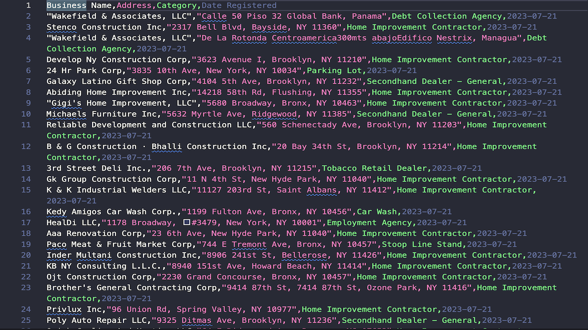

# OpenGovUS Business Scraper

_Structured business listings → clean CSVs, with post-processing & summaries._


A production-style Python scraper that collects business registration data from **OpenGovUS** and writes tidy CSVs. It renders pages with **Playwright**, parses with **BeautifulSoup**, and includes optional **post-processing** and **summary** steps so clients can use the data immediately.

---

## 🔍 Key Features

- **Dynamic rendering** with Playwright (Chromium) to handle JS.
- **Structured fields** exported to CSV: `Business Name`, `Address`, `Category`, `Date Registered`.
- **Pagination** across multiple result pages.
- **Basic stealth** tactics to reduce trivial bot detection.
- **Post-processing** script to dedupe, clean, and sort records.
- **Summary** generator (plain text + Markdown) for quick insights.

---

## ⚙️ Quick Start

### Prerequisites

- Python **3.10+**
- Git
- Playwright browsers (install step below)

### Installation

```bash
# 1) Clone
git clone https://github.com/mdugan8186/opengovus-scraper.git
cd opengovus-scraper

# 2) (optional) Virtual environment
python -m venv .venv
# macOS/Linux:
source .venv/bin/activate
# Windows:
.venv\Scripts\activate

# 3) Install dependencies
pip install -r requirements.txt

# 4) Install Playwright browsers (first run only)
python -m playwright install chromium
```

### Run the Scraper

```bash
python script.py
```

- Writes the raw CSV to: `output/opengovus_listings.csv`

### Optional: Post-process & Summarize

```bash
# Clean & sort, save to samples/cleaned_listings.csv
python postprocess.py

# Create text + markdown summaries from the cleaned CSV
python summarize_data.py
```

- Outputs:
  - `samples/cleaned_listings.csv`
  - `output/summary.txt`
  - `samples/summary.md`

---

## 📁 Output

- **Primary CSV**: `output/opengovus_listings.csv`
- **Cleaned CSV** (optional): `samples/cleaned_listings.csv`

**Columns**

```
Business Name, Address, Category, Date Registered
```

---

## 🧩 Configuration & Selectors

- CSS selectors and parsing logic live in the code (`script.py`). If the site HTML changes, update the selectors there.
- For long-term maintainability, you can extract selectors into a `config/` JSON (future enhancement).

---

## 🎥 Demo

Example of the scraper output:



The full dataset is saved as a CSV: [`output/opengovus_listings.csv`](output/opengovus_listings.csv)

---

## 🧪 Testing & Dev Notes

See **TESTING.md** for a step-by-step sanity flow (render → extract → clean → summarize), selector maintenance notes, and data-quality checks.

---

## 🛠️ Tech Stack

- **Playwright (Python)** for rendering
- **BeautifulSoup** for parsing
- **pandas** for cleaning & summaries
- **CSV** outputs for easy analysis

---

### ⚖️ Legal & Ethical Use

This scraper includes basic measures (delays, browser automation) to reduce trivial blocking and ensure reliable data collection.  
It is provided for **educational and demonstration purposes only**. Please review and comply with the target site’s terms of service and robots.txt before running it at scale.

---

## 📄 License

This project is licensed under the **MIT License**. See [`LICENSE`](./LICENSE).

---

## 👤 About

**Mike Dugan** — Python Web Scraper & Automation Developer

- **GitHub:** [@mdugan8186](https://github.com/mdugan8186)
- **Portfolio Website:** [scraping-portfolio](https://mdugan8186.github.io/scraping-portfolio/)
- **Fiverr:** [Hire Me for a Custom Web Scraper](https://www.fiverr.com/s/99aN6vA)
- **Email:** [mdugan8186.work@gmail.com](mailto:mdugan8186.work@gmail.com)
